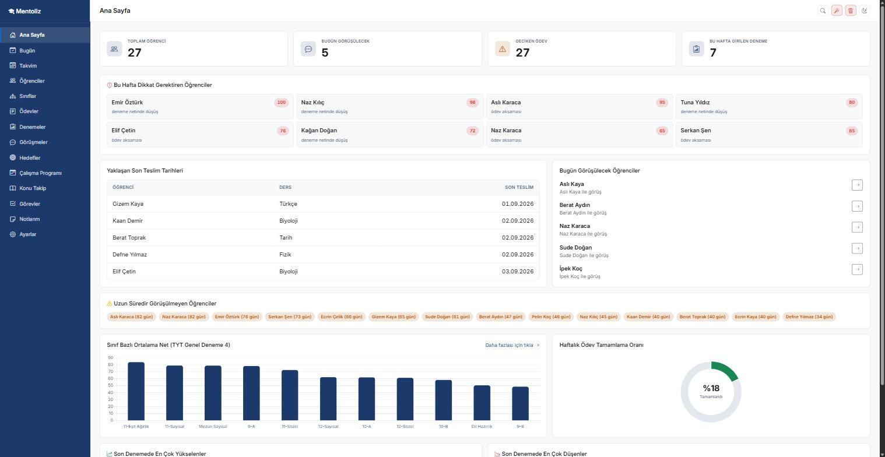
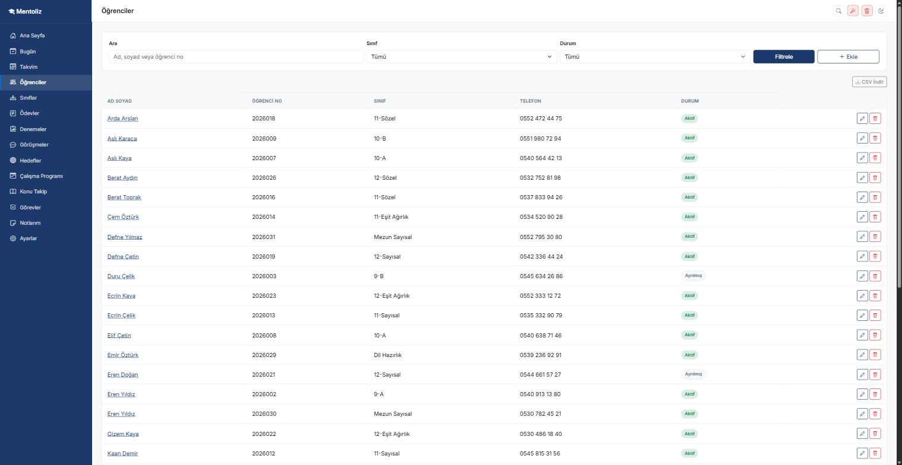
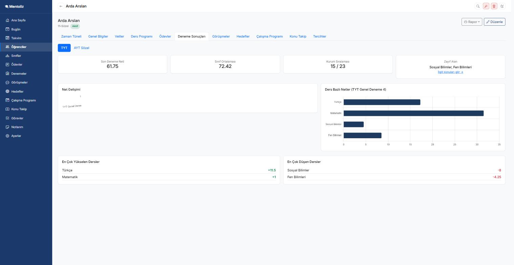
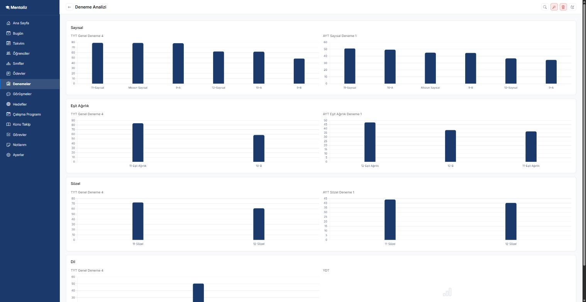
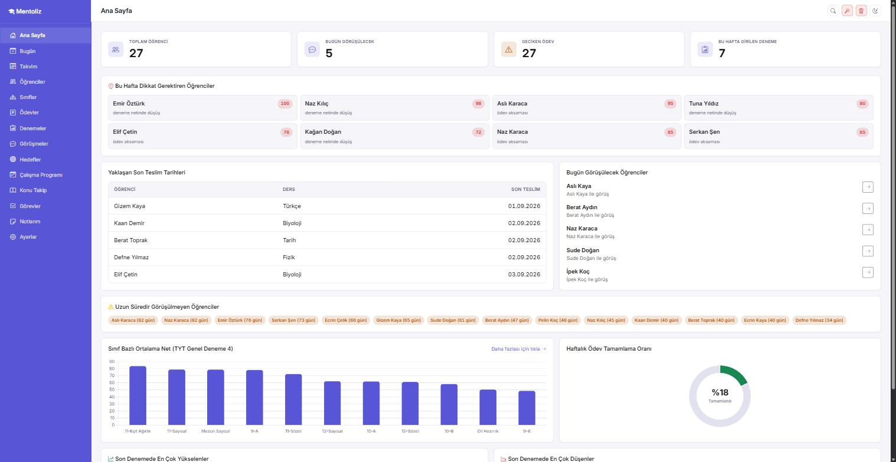

# Mentoliz

Mentoliz, özel bir dershanede çalışan bir rehber öğretmenin kendi öğrencilerini takip etmesi için yazılmış bir masaüstü uygulamasıdır. Tek kullanıcı, tek bilgisayar ve sunucusuz çalışacak şekilde tasarlandı; ne bir ağ bağlantısına ne de bir girişe ihtiyaç duyar.

Bu proje ticari bir ürün değildir, portföy amacıyla MIT lisansıyla açık kaynak olarak paylaşılmıştır.

## Özellikler

- Öğrenci ve veli bilgilerinin yönetimi, sınıflara ayrılması
- Haftalık ders programı şablonları ve öğrenciye özel istisnalar (özel ders, etüt, telafi, iptal)
- Kurumda bulunma süresinin birleşik programdan otomatik hesaplanması
- Bireysel ve sınıfa toplu ödev atama, tamamlanma takibi
- Deneme sınavı tanımlama, hızlı sonuç girişi, net hesabı
- Ders ve alan bazlı deneme analizi grafikleri, kurum içi sıralama, zayıf alan tespiti
- Birebir görüşme kayıtları ve zaman çizelgesi
- Hedef tanımlama ve hedefe uzaklık göstergesi
- Haftalık çalışma programı takibi
- Konu takip çizelgesi ve zayıf konulardan otomatik öneri
- Üniversite tercih listesi takibi
- Ana sayfa istatistik paneli ve görev/hatırlatma listesi
- Yazdırılabilir öğretmen raporu, veli raporu ve dönem sonu değerlendirme raporu
- Öğrenci listesi ve deneme sonuçları için CSV dışa aktarma
- Veritabanı yedekleme ve geri yükleme
- Beş renk teması ve gece modu
- WebView2 tabanlı masaüstü kabuğu ile bağımsız Windows uygulaması olarak çalışabilme

## Teknoloji yığını

- .NET 10, ASP.NET Core MVC
- Entity Framework Core, SQLite
- FluentValidation
- Bootstrap 5, Bootstrap Icons
- Chart.js
- WebView2 (masaüstü kabuğu için)
- Vanilla JavaScript

## Mimari

N katmanlı bir yapı kullanılıyor, katmanlar tek yönlü referans veriyor:

```
Mentoliz.Entities              entity sınıfları ve enum'lar, başka hiçbir katmana bağımlı değil
Mentoliz.DataAccess            DbContext, repository'ler, migration'lar
Mentoliz.Business              DTO sınıfları, servisler, doğrulama kuralları, entity-dto eşlemeleri
Mentoliz.Web                   controller'lar, view'lar, tarayıcıdan çalıştırılabilen giriş noktası
Mentoliz.Web/Mentoliz.Masaustu WebView2 penceresi, aynı sunucuyu yerel bir portta başlatıp gösteren kabuk
```

Web katmanı veritabanına asla doğrudan erişmez, her şey servisler üzerinden yürür. Masaüstü kabuğu da kendi iş mantığını içermez, sadece Mentoliz.Web'in kurduğu sunucuyu farklı bir pencerede gösterir.

## Çalıştırma

### Tarayıcıda

```
cd Mentoliz.Web
dotnet run
```

Uygulama `https://localhost:7186` adresinde açılır. Veritabanı dosyası ilk çalıştırmada otomatik oluşturulur ve demo verisiyle doldurulur.

### Masaüstü uygulaması olarak

```
cd Mentoliz.Web/Mentoliz.Masaustu
dotnet run
```

Bu, aynı sunucuyu arka planda başlatıp içeriği bağımsız bir Windows penceresinde WebView2 ile gösterir, tarayıcı açmaya gerek kalmaz.

## Ekran görüntüleri

| | |
|---|---|
| **Ana sayfa** | **Öğrenci listesi** |
|  |  |
| **Öğrenci bazlı deneme analizi** | **Genel deneme analizi** |
|  |  |
| **Ana sayfa (indigo tema)** | |
|  | |

## Lisans

Bu proje MIT lisansı ile lisanslanmıştır, ayrıntılar için `LICENSE` dosyasına bakınız. Kullanılan üçüncü taraf kütüphaneler için `THIRD-PARTY-NOTICES.md` dosyasına bakınız.
